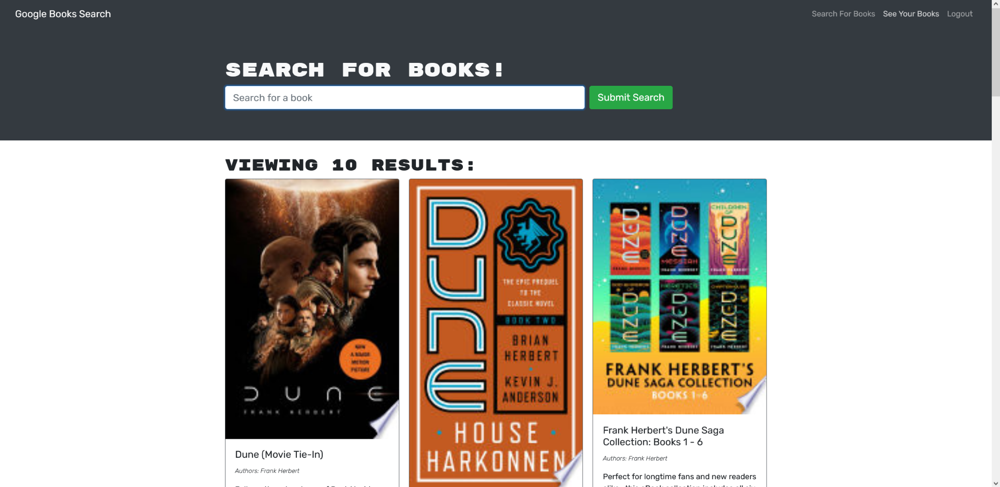

# Carl's Book Search

## Description

A simple site to look up books using googles book library API. See book titles, authors, covers, synopsis, and a link to more information. Sign up to save your favorite books to easily find later. Uses REACT and GraphQL via Apollo.

## Table of Contents

- [Usage](#usage)

- [Credits](#credits)

- [License](#license)

- [Contributing](#contributing)

- [Questions](#questions)

## Usage

As an avid reader, I want an easy way to save book recomendations for the next time I'm at a book store.

## Credits

Created by CarlJMcGee

## License

[This project uses MIT License](./mit.txt)

## Contributing

[Click to see the Contributor Covenant guidelines](./code_of_conduct.md)

## Questions?

If you have any issues, submit them to my [Github](https://github.com/CarlJMcGee)

or

If you have any other questions or inquiries, you can contact me at [Carl.Jack.McGee@gmail.com](mailto:Carl.Jack.McGee@gmail.com)

## [>>Click here to check it out!<<](https://carls-book-search.herokuapp.com/)

